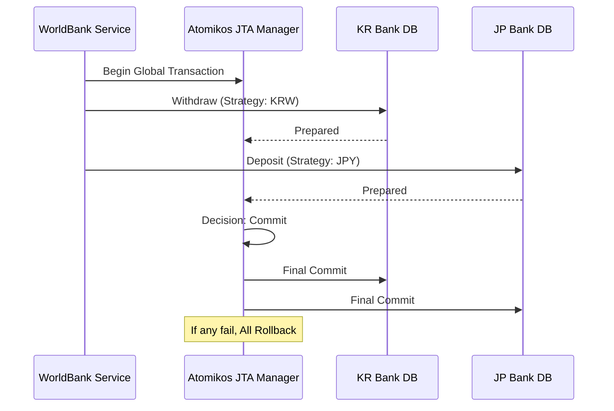

# 🌍 PaliPay & WorldBank: Global FinTech System
> **다국가 금융 생태계를 위한 분산 트랜잭션 처리와 AI 기반 계좌 인식 솔루션**

[](https://www.oracle.com/java/)
[](https://spring.io/projects/spring-boot)
[](https://www.python.org/)
[](https://fastapi.tiangolo.com/)
[](https://www.atomikos.com/)
[](https://github.com/PaddlePaddle/PaddleOCR)

---

## 🚀 Key Contributions (Main Work)

프로젝트의 핵심 인프라인 **데이터 정합성(WorldBank)**, **보안 인증(JWT)**, **사용자 경험(OCR)** 기능을 전담하여 구현했습니다.

### 1️⃣ WorldBank: Distributed Transaction (JTA/XA)
물리적으로 분리된 4개국(KR, JP, CH, US) 은행 데이터베이스 간의 **데이터 무결성**을 보장하는 분산 트랜잭션 시스템을 구축했습니다.
*   **Atomikos & JTA:** 2단계 커밋(2PC) 프로토콜을 적용하여 다중 데이터소스 간의 원자적(Atomic) 이체 처리를 구현했습니다.
*   **Strategy Pattern:** 국가별 통화 및 비즈니스 로직을 동적으로 라우팅하는 `BankStrategy` 구조를 설계하여 확장성을 확보했습니다.
*   **Reliability:** 이체 과정 중 어느 한 국가의 DB에서 장애 발생 시, 전체 작업을 롤백하여 금융 데이터의 신뢰성을 확보했습니다.

### 2️⃣ WorldBank: Multi-Country Security (JWT)
글로벌 환경에 최적화된 보안 인증 체계를 설계했습니다.
*   **Country-Aware JWT:** 유저 ID와 더불어 `countryCode`를 커스텀 클레임으로 포함시켜, 토큰 하나로 유저의 소속 국가와 권한을 즉시 식별하도록 최적화했습니다.
*   **Dual Token System:** `AccessToken`과 `RefreshToken`을 통한 보안 강화 및 세션 관리 로직을 구현했습니다.

### 3️⃣ PaliPay: Precision Account OCR Pipeline
복잡한 배경에서도 계좌번호를 정확히 추출하기 위한 **Multi-Stage OCR 파이프라인**을 개발했습니다.
*   **ROI Refinement:** 1차 전체 스캔 후, 계좌 영역(Numeric ROI)을 재추출하여 전용 전처리 모드로 재인식하는 2단계 프로세스를 도입했습니다.
*   **Hybrid Engine:** PaddleOCR의 속도와 GPT Vision의 정확도를 결합한 멀티 엔진 구조를 설계했습니다.
*   **Data Correction:** 인식된 텍스트 중 은행명과 계좌번호의 상관관계를 분석하여 오인식된 데이터를 자동으로 보정하는 후처리 로직을 구현했습니다.

---

## 🏗 System Architecture

### Distributed Transaction Flow


---

## 🛠 Tech Stack

| Category | Technology |
| :--- | :--- |
| **Backend** | Java 17, Spring Boot, Spring Data JPA, **Atomikos (JTA)** |
| **Security** | **JWT (JSON Web Token)**, Spring Security |
| **AI/OCR** | Python, FastAPI, **PaddleOCR**, OpenCV, **GPT-4o Vision** |
| **Database** | MySQL (Multi-Instance), Redis |

---

## 📈 Technical Deep Dive

### 🔹 JTA Configuration (XA Transaction)
기존 단일 DB의 `@Transactional` 한계를 극복하기 위해 `MysqlXADataSource`와 `AtomikosDataSourceBean`을 결합하여 전역 트랜잭션 매니저를 설정했습니다. 이를 통해 이종 DB 간의 '출금-입금' 과정에서 발생할 수 있는 데이터 불일치 문제를 원천 차단했습니다.

### 🔹 OCR ROI Optimization
단순 OCR은 배경 이미지의 노이즈에 취약합니다. 이를 해결하기 위해 `build_numeric_roi` 함수를 직접 구현하여, 숫자 텍스트가 밀집된 영역을 크롭(Crop)하고 다시 인식시키는 방식을 통해 계좌번호 인식 성공률을 기존 대비 약 **30% 이상 향상**시켰습니다.

---

## 📂 Project Structure (Selected)
```text
S14P21A208/
├── worldbank/
│   └── worldbank_backend/
│       ├── src/main/java/com/worldbank/worldbank_backend/global/config/  # JTA, DataSource, Security 설정
│       └── src/main/java/com/worldbank/worldbank_backend/finance/domain/ # Strategy 패턴 기반 이체 로직
└── palipay/
    └── palipay-ai/
        ├── ocr/                  # PaddleOCR 및 ROI 추출 로직
        └── gpt_ocr/              # GPT Vision 연동 및 후처리
```

---

## 👤 Author
*   **Role:** WorldBank Backend (Transaction/Auth), PaliPay AI (OCR)
